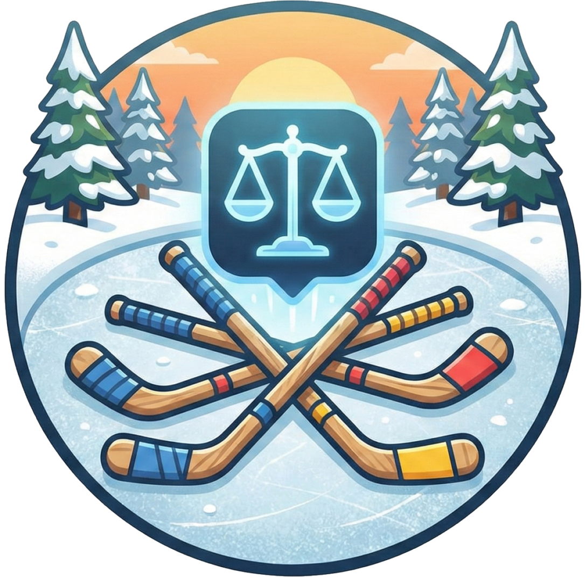

# Stick Toss

A weighted team randomizer for pickup pond hockey games. Because sometimes the teams that come out of the literal stick pile are hilariously unbalanced, and nobody wants to play a 12-2 snoozefest when you've only got the rink for an hour. Stick Toss lets you assign skill weights to players and generates random-but-fair teams, so you can keep the spirit of the stick pile while actually having competitive games. Perfect for beer league organizers, pond hockey groups, or anyone tired of watching one team cycle the puck for 45 minutes while the other team practices their defensive zone faceoffs.

## Features

- **Player Management**: Create and manage players with skill weights (1-5, from Bender to Ringer)
- **Groups**: Organize players into different groups for different games or leagues
- **Smart Team Generation**: Algorithm balances teams based on total skill weights
- **Player Locking**: Lock specific players together on the same team
- **Mobile Responsive**: Works great on phones for rink-side team generation
- **User Accounts**: Each user manages their own players and groups

## Tech Stack

- **Backend**: Go with Gin framework
- **Frontend**: Svelte with Vite
- **Database**: SQLite (dev) / PostgreSQL (production)
- **Auth**: JWT tokens
- **Deployment**: Docker

## Quick Start

### Run with Docker Compose (Recommended)

The easiest way to get started:

```bash
docker-compose up --build
```

Access the app at **http://localhost:8080**

This runs the full stack with PostgreSQL. To stop: `docker-compose down`

### Deploy to Miren

TODO

### Local development and more..

See **[DEVELOPMENT.md](DEVELOPMENT.md)** for:
- Local development setup (Go + Node.js)
- Building production images
- Running tests
- Detailed troubleshooting
- API testing examples

## Configuration

Environment variables (see `.env.example`):

- `DB_DRIVER`: Database driver (`sqlite` or `postgres`)
- `DATABASE_URL`: Database connection string
- `JWT_SECRET`: Secret key for JWT tokens (change in production!)
- `PORT`: Server port (default: 8080)
- `GIN_MODE`: Gin mode (`debug` or `release`)

## API Endpoints

### Authentication
- `POST /api/auth/signup` - Create account
- `POST /api/auth/login` - Login
- `GET /api/auth/me` - Get current user (protected)

### Players
- `GET /api/players` - List all players
- `GET /api/players/:id` - Get player
- `POST /api/players` - Create player
- `PUT /api/players/:id` - Update player
- `DELETE /api/players/:id` - Delete player

### Groups
- `GET /api/groups` - List all groups
- `GET /api/groups/:id` - Get group with players
- `POST /api/groups` - Create group
- `PUT /api/groups/:id` - Update group
- `DELETE /api/groups/:id` - Delete group
- `POST /api/groups/:id/players` - Add player to group
- `DELETE /api/groups/:id/players/:player_id` - Remove player from group
- `POST /api/groups/:id/generate-teams` - Generate balanced teams

## Project Structure

```
sticktoss/
├── backend/
│   ├── cmd/server/          # Main application entry point
│   ├── internal/
│   │   ├── api/             # HTTP handlers
│   │   ├── auth/            # Authentication & JWT
│   │   ├── db/              # Database connection
│   │   ├── models/          # Data models
│   │   └── teamgen/         # Team generation algorithm
│   └── go.mod
├── frontend/
│   ├── src/
│   │   ├── lib/             # API client & stores
│   │   ├── routes/          # Svelte pages
│   │   └── App.svelte
│   └── package.json
├── Dockerfile
├── docker-compose.yml
└── README.md
```

## License

MIT

## Contributing

Pull requests welcome! You're here, aren't ya?
